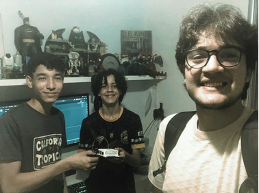
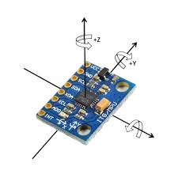
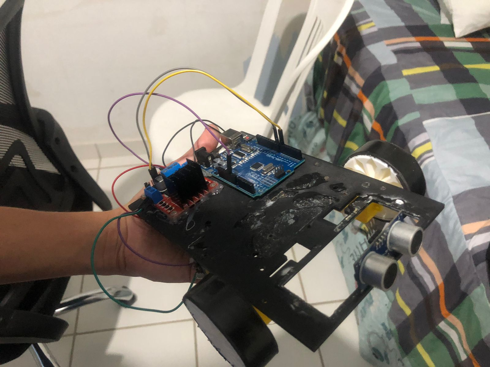

### **1º dia: Relatório Técnico de Treinamento – Equipe Doomscrollers**
Data: Sábado, 23/05/2026 | Duração: 15:00h às 18:45h
Participantes: João Serafim, Geovanny Dias, Carlos Daniel (Mentor).

1. Diretrizes Estratégicas e Objetivos Técnicos

Meta de Desempenho: Alcançar a classificação para a etapa Estadual e estabelecer o robô entre as 10 melhores pontuações da categoria.
Requisitos Estruturais: Desenvolver uma plataforma móvel estável e um algoritmo de rastreamento de linha com validação completa de trajetos antes da integração de sistemas secundários.
Competências Tecnológicas Autônomas: Investigar a integração entre hardware e software através do estudo aplicado de:

* Linguagem C++ para arquitetura Arduino;
* Linguagem Python para processamento em placa Raspberry Pi;
* Biblioteca OpenCV direcionada à segmentação de imagem e identificação de elementos de pista (linhas e marcadores verdes).

2. Engenharia Reversa e Análise do Protótipo de Referência
Análise do dispositivo apresentado pelo mentor Carlos Daniel, focando em arquitetura física, topologia de circuitos e distribuição de massa.
Mapeamento Lógico: Elaboração de diagrama de blocos para documentar o fluxo de dados dos sensores periféricos para a unidade central de processamento.

3. Execução Prática e Prototipagem
Início da montagem física da iteração inicial do chassi (Versão 0.1), compreendendo o alinhamento dos eixos de tração e a fixação mecânica dos atuadores.

4. Próximos Passos (Plano de Ação para o próximo treino):

- Geovanny Dias: Executar a montagem física da base motora para calibração do deslocamento em linha reta.

- João Serafim: Iniciar o ambiente de desenvolvimento de visão computacional em ambiente de bancada (Python + OpenCV).

3. Fotos do treino

### **2º dia: Relatório Técnico de Treinamento – Equipe Doomscrollers;**
Data: Segunda, 25/05/2026 | Duração: 17:40h às 19:15h;
Participantes: João Serafim, Geovanny Dias.

1. Execução prática, prototipagem e manutenção:

Ajustes de partes quebradas do robô, além da adição de um ultrassônico em sua fronte, e deslocação dos motores para a dianteira.

2. Planejamento para postagens no instagram
	
	- Post apresentando os competidores, com identidade visual semelhante à quadrinhos
	
	- Post de curiosidade sobre as mudanças na OBR

3. Experimentação

Testamos o módulo MPU6050, não tivemos sucesso na execução, mas aprendemos que ele é composto de um sensor giroscópio, acelerômetro e sensor de temperatura. Pretendemos usa-lo para compor um algorítmo de variação da velocidade, com a finalidade de auxiliar o robô nas rampas da competição.

4. Registros fotográficos:

